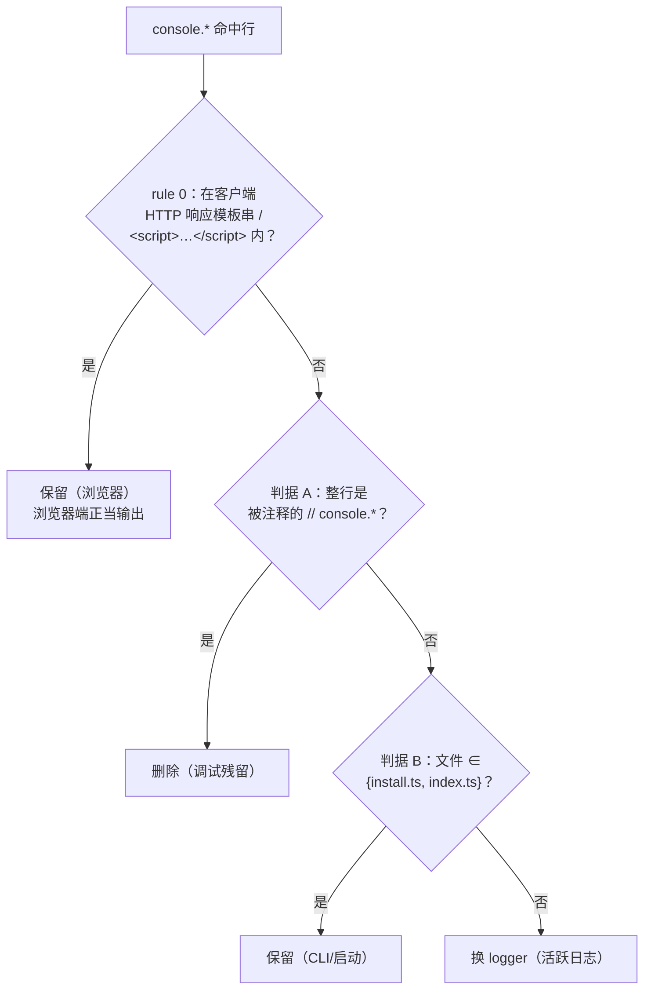

# console.* 日志收敛策略

本文档记录 BRConnector（`src/` 下 TypeScript 源码）里裸 `console.*` 调用的收敛策略：如何逐行分类、哪些换成 `logger`、哪些保留、以及未收敛部分的推进顺序。它面向后续做收敛的开发者 —— 目标是「换个人来做也能得到同一套结果」。

> 本轮实际落地的只有 `src/providers/gemini_converse.ts` 的 2 处改动（见 [本轮已落地范围](#本轮已落地范围)）。其余为待办清单与判据，供后续分批执行。

## 背景

项目用 winston 做结构化日志：`src/util/logger.ts` 默认导出一个 logger，调用方 `import logger from '<相对路径>/util/logger'` 后用 `logger.info/warn/error/debug(...)`。但 `src/` 下仍散落 197 处裸 `console.*`。收敛的目标是把**服务端的活跃日志**统一到 `logger`，同时**不误伤**面向运维的 CLI 输出和面向浏览器的客户端输出。

## 四类分类判据（可机械执行）

对每条 `grep -rnE "console\.(log|error|warn|info|debug)" src` 命中行，**按顺序**判定，命中即停：



### rule 0 —— 保留（客户端 HTTP 响应模板串内的 console）｜最高优先，本轮新增

命中行处于某个 `ctx.body = \`` 起始的模板字符串范围内，**或**夹在同文件的 `<script>` 与 `</script>` 之间 → **保留**。

- 判定信号（同文件内、按行号区间静态判定）：先 `grep -qE "<script>|ctx\.body *= *\`" <file>` 筛出含客户端模板的文件；再核命中行行号是否落在 `<script>`（起）/ `</script>`（止）区间内。
- 为什么保留：这是浏览器端正当输出，`logger` 是服务端模块级 import，在浏览器作用域未定义，换过去会 `ReferenceError`。与「保留（CLI）」同理。
- **当前唯一命中**：`src/middleware/portal_for_brclient.ts:65 / 73 / 78`，共 3 处。

### 判据 A —— 删除（调试残留）

去掉 `file:line:` 前缀后，首个非空白字符是 `//`（整行被注释的 `// console.*`）→ **删除该行**（连同纯注释块）。

- 正则：`^[^:]+:[0-9]+:[[:space:]]*//`
- 共 123 处。

### 判据 B —— 保留（CLI / 启动输出）

不满足 rule 0 / A，且文件路径 ∈ {`src/install.ts`, `src/index.ts`} → **保持 console 不动**（面向运维的正当输出）。

- 正则：`^src/(install|index)\.ts:`
- 共 26 处。

### 判据 C —— 换 logger（活跃业务 / 诊断日志）

不满足 rule 0 / A / B 的其余活跃日志 → 换成 `logger.<level>`（模块级 `import logger from '<相对路径>/util/logger'`；请求链上有 `ctx` 时优先 `ctx.logger`）。共 45 处。

**level 子规则（机械，按顺序命中即停）：**

1. `console.error(...)` → `logger.error(...)`（保留原始 error 对象作第二参，交给 winston `errors({stack})`）
2. `console.warn(...)` → `logger.warn(...)`
3. `console.log(...)` 且被显式 debug 守卫包裹（最近外层 `if` 含 `debug` / `debugMode`，如 `util/postgres.ts` 的 `if (this.debug)`）→ `logger.debug(...)`
4. `console.log(...)` 且实参为纯对象 / JSON dump、无人类可读前缀字符串 → `logger.debug(...)`
5. 其余 `console.log(...)` → `logger.info(...)`

### 分布统计（回填 197，四类互斥完备）

| 目录 / 文件 | 总数 | A 删除 | B 保留(CLI) | rule 0 保留(浏览器) | C 换 logger |
|---|---:|---:|---:|---:|---:|
| `src/providers/` | 128 | 108 | 0 | 0 | 20 |
| `src/install.ts` | 21 | 0 | 21 | 0 | 0 |
| `src/util/` | 18 | 8 | 0 | 0 | 10 |
| `src/controller/` | 14 | 3 | 0 | 0 | 11 |
| `src/middleware/` | 8 | 2 | 0 | **3** | **3** |
| `src/index.ts` | 6 | 1 | 5 | 0 | 0 |
| `src/service/` | 2 | 1 | 0 | 0 | 1 |
| **合计** | **197** | **123** | **26** | **3** | **45** |

**桶 C（45 处）按文件**：`controller/bot/Feishu.ts` 11、`util/postgres.ts` 6、`util/helper.ts` 4、`providers/simple_action.ts` 4、`providers/sagemaker-deepseek.ts` 3、`providers/nova_canvas.ts` 3、`providers/abstract_provider.ts` 3、`middleware/handlers.ts` 3（**禁改**）、`providers/smart_router.ts` 2、`providers/sagemaker_lmi.ts` 2、`providers/gemini_converse.ts` 2、`service/bot_connector.ts` 1、`providers/titan_embedings.ts` 1。

## 建议的 `no-console` eslint 配置

> ⚠️ 仅**建议文本**，本轮**未**写进 `eslint.config.js`。当前 `eslint.config.js` 只把 `console` 声明为 readonly 全局、无 `no-console` 规则。**不要现在就全局开启** —— 桶 C 尚有 45 处未收敛，立刻 `no-console: error` 会让 lint 全红、卡住并行 workflow。建议按目录分批引入，或全量收敛后一次性开启。

ESLint 9 flat config，追加到 `src` 段之后：

```js
// 主规则：src 下禁止裸 console（收敛完成后启用）
{
  files: ["src/**/*.ts"],
  rules: { "no-console": "error" },
},
// allowlist：CLI / 启动脚本的 console 是面向运维的正当输出，豁免
{
  files: ["src/install.ts", "src/index.ts"],
  rules: { "no-console": "off" },
},
// 预留：若日后 src/scripts/ 下出现 .ts CLI 脚本，同样豁免
{
  files: ["src/scripts/**/*.ts"],
  rules: { "no-console": "off" },
},
```

allowlist 路径：`src/install.ts`、`src/index.ts`、`src/scripts/**`。

### 局限：客户端模板串内的 console 无法用 files-glob 精确豁免

`no-console` 的 files-glob 无法精确豁免 rule 0 那类 console：`src/middleware/portal_for_brclient.ts` **同一文件里既有服务端代码、又有客户端模板 console**。用 files-glob 要么放过整文件（未来该文件新增服务端 console 也不报），要么误伤。处理方向二选一（待人类拍板，见 [遗留待拍板项](#遗留待拍板项)）：

1. **行内豁免**：portal 那 3 行加 `// eslint-disable-next-line no-console`（最小改动，保留文件级 `no-console`）；
2. **抽静态资源**：把 portal 的 HTML/JS 模板抽成独立静态文件（非 `.ts`），eslint 不再扫描其内 console，判据也更干净。

## 本轮已落地范围

本轮落地的是 **`src/providers/gemini_converse.ts` 的 2 处 `console.error → logger.error`**（桶 C / level 子规则 1），并在文件顶部新增 `import logger from "../util/logger";`。

```diff
@@ import { GoogleGenerativeAI } from "@google/generative-ai";
+import logger from "../util/logger";
@@ } catch (error) {
-      console.error('Gemini streaming error:', error);
+      logger.error('Gemini streaming error:', error);
@@ } catch (error) {
-      console.error('Gemini sync error:', error);
+      logger.error('Gemini sync error:', error);
```

- 落地后 `grep -rnE "console\." src/providers/gemini_converse.ts` 为空。
- 实现 PR：fork 内 **#21**（`BMAD-27: converge console.error→logger.error in gemini_converse.ts`），Review **PASS**（0 blocker）+ Test gate **PASS**（65/65 tests，覆盖率 P1 2/2 = 100%）。
- 测试补充 PR：fork 内 **#22**（新增 `test/gemini_converse_logger.test.ts`）。

**为什么不是 middleware**：原编排预设的目标是 `src/middleware/portal_for_brclient.ts`。经复核，那 3 处 `console.error` 全在客户端 `<script>` 模板串内，命中 rule 0 改判「保留（浏览器）」；middleware 里其余 console 都在禁改的 `handlers.ts`。故本轮目标改选到无客户端陷阱的 `gemini_converse.ts`。

## 剩余未改清单 + 建议改进顺序

portal 的 3 行已改判「保留（浏览器）」，不再计入待收敛。待收敛 = 桶 A **123 删** + 桶 C **45 换**。按「边界清晰、单目录可评审、风险低 → 高」排序：

| 顺序 | 范围 | 桶 A 删 | 桶 C 换 | 说明 |
|---|---|---:|---:|---|
| 1（已做）| `src/providers/gemini_converse.ts` | 0 | 2 | 本轮已落地 |
| 2 | `src/service/`（`bot_connector.ts`）| 1 | 1 | 量最小 |
| 3 | `src/util/`（**排除 `logger.ts`**）| 8 | 10 | `postgres.ts` debug-dump → `logger.debug` |
| 4 | `src/controller/`（`bot/Feishu.ts` 为主）| 3 | 11 | 单文件集中 |
| 5 | `src/providers/`（余下，按单文件切 PR）| 108 | 18 | 最大头 |
| 6 | `src/middleware/handlers.ts`、`src/index.ts` | 3 | 3 | **锁定文件**：等 logger 结构化改造合并后再收敛 |

**永久保留**：`install.ts`(21) + `index.ts` CLI(5) = 桶 B 26 处；portal 客户端模板 3 处。

### 与 logger 结构化改造（issue 118f52aa）的关系

`src/util/logger.ts`、`src/middleware/handlers.ts`、`src/index.ts` 是**跨-workflow 禁改文件** —— 另一条 workflow（issue `118f52aa`，logger 结构化改造）正在改它们。本策略的顺序 6 里这几个文件必须**等其合并后再收敛**，避免冲突。

## 遗留待拍板项

以下需人类决策，本轮不替其拍板：

1. **`no-console` 全局启用时机与 `eslint.config.js` 归属** —— 现在全局开启会因桶 C 尚有 45 处未收敛导致 lint 全红、卡住并行 workflow。建议分批引入或全量收敛后一次性开启；`eslint.config.js` 的归属需人类协调。
2. **portal 客户端模板 console 的处理方向** —— 行内 `eslint-disable`（最小改动）vs 抽静态资源（更干净）。见 [局限](#局限客户端模板串内的-console-无法用-files-glob-精确豁免)。

### （可选）仓库级 logger 行为注意点

Review 环节实测发现两点**共享 logger 约定**、非本轮范围，供后续统一决策：

- **非 Error 原始值抛出时日志缺失**：当 `throw 'some-string'` 这类非 Error 原始值时，winston 将其作 splat/meta 处理，而 message 无 `%` 占位符 → 该原始值不入日志。相较原 `console.error` 是信息回退。仅在极少见的非 Error throw 时触发，且属仓库既有约定（`util/cache.ts:28` 同款）。如需覆盖：`logger.error('...: %o', error)` 或模板串 `` logger.error(`...: ${error?.message ?? String(error)}`) ``。
- **error 级别走 stdout 而非 stderr**：winston `Console` 默认 `stderrLevels: []`，error 级别写 stdout（原 `console.error` 走 stderr）。影响 `2>` 捕获与基于 stderr 的告警。如运维要求 error 走 stderr：`new transports.Console({ stderrLevels: ['error'] })`（属禁改文件 `logger.ts`，需另开卡）。

> 注：对**正常抛出的 Error**（绝大多数情况），winston 正确折叠 message 并输出完整 stack，信息面不弱于 `console.error`。上述两点仅为边缘情形。
